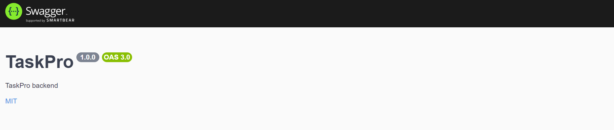
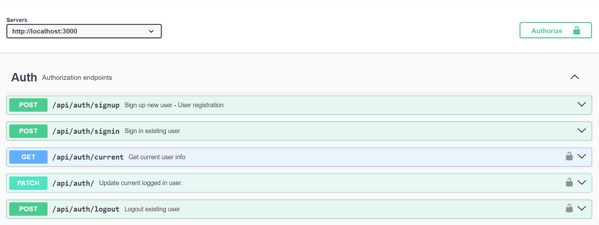
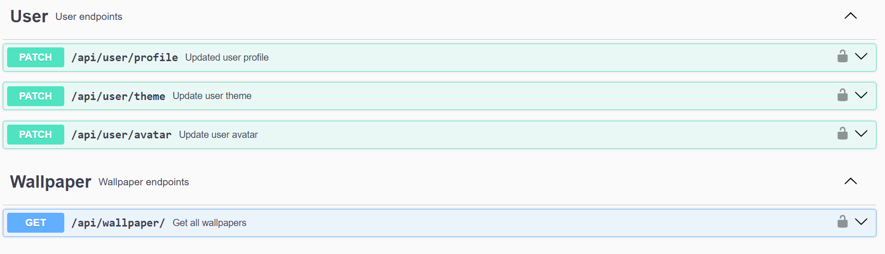
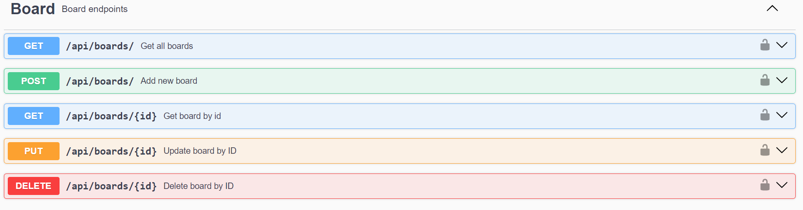
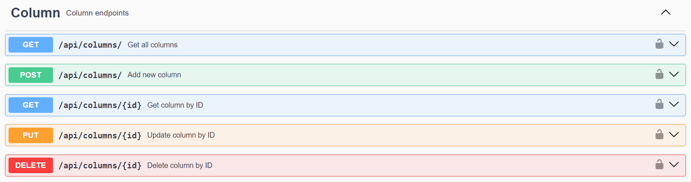
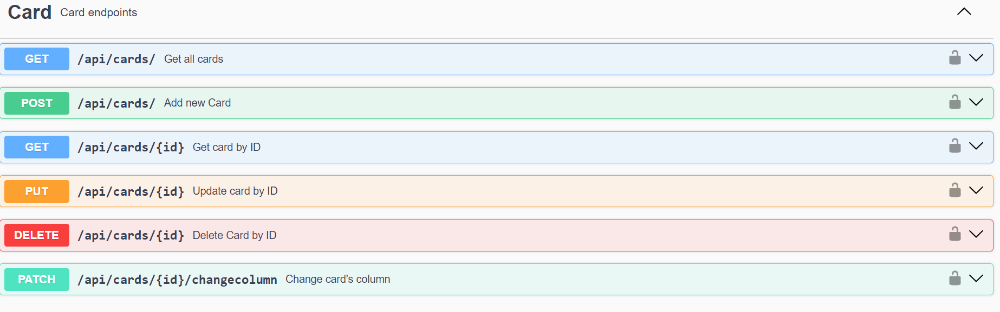
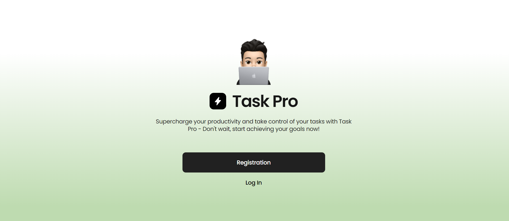

# Final Team Project GoIT Academy "PRO TASK"
***

## Developers Team:

1. Bogdan Protasenko - `Team Lead`
2. Igor Nagrebelnyi - `Scrum Master`

`Developers:`

3. Anastasiia Sidorova
4. Andrii Zubko
5. Andrii Bezkrovnyi
6. Lesia Melaverde
7. Marta Shchur
8. Artem Satanovskiy
9. Galina Oryniak
10. Valentyna Kyryliuk
11. Olga Sharhorodska 

## Page layout

[Links to the Figma layout of the project "PRO TASK"](<https://www.figma.com/file/pSdUVzA3Ptey4JnZMJX90N/TaskPro-(Copy)?node-id=87%3A363>)

## Repositories of our project

[Link to Frontend](https://github.com/bogdanproto/protask-frontend)  

[Link to Backend](https://github.com/bogdanproto/protask-backend)   
 

## Technologies Used

Here are some of the key technologies used in this project:
### Front-end

- 
- 
- 
- 
- 
- 

### Back-End

- 
- 
- 

### Utilites:

- 
- 
- 
- 

## API Documentation
For detailed descriptions of API requests and interactions, refer to the [link to Swagger](https://protask-backend.onrender.com/api-docs)

## Website

[Link to Website (full version)](https://main--thunderous-florentine-b19306.netlify.app/welcome)

## Review

This application allows the user to plan tasks and track their progress.

The application functionality allows you to create a nested structure:

- Work direction;
- Subdirections;
- Task cards by subdirections.
- All these elements can be edited and deleted.

The functionality of the cards allows you to change:

- Name;
- Description;
- Priority;
- End date for task completion;
- Moving to another subdirection.

If the task must be completed today, a colored bell appears on the card.

### We are confident that the application will be liked by the user and will be useful to him.

***   
***

## Requirements

Before getting started with the project, make sure you have the following tools installed on your computer:

- Node.js (version 12 or higher)

## Installation

1. Clone this repository to your local computer.
2. Open the terminal and navigate to the root folder of the project.
3. Run the command `npm install` to install project dependencies.

## Configuration

1. Create a .env file in the project's root folder, based on the .env.example file.
2. Specify the necessary environment variables in this file.

## Server Commands

**npm:**

- `npm start` — Start the server in production mode.
- `npm run start:dev` — Start the server in development mode.
- `npm run lint` — Run code linting using eslint. Perform this before each PR and fix all linting errors.
- `npm run lint:fix` — Similar to lint command, but automatically fixes simple linting errors.
